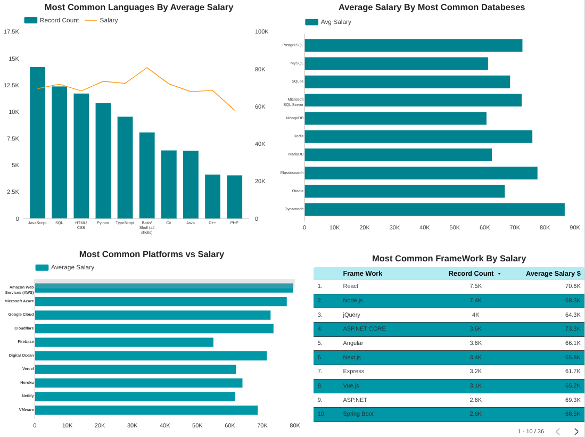
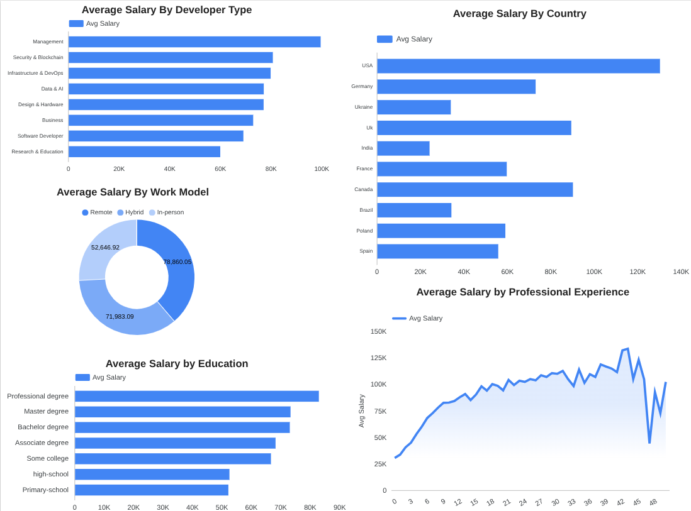
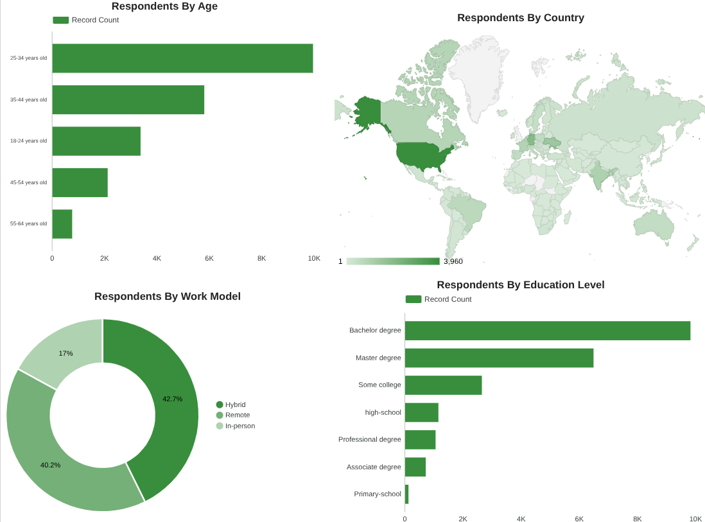

# 📊 End-to-End Analysis of Stack Overflow Developer Survey

##  Project Overview

This project analyzes the Stack Overflow Developer survey to uncover key insights about developers' current and future technology preferences and demographic characteristics, the analysis covers technology categories such as languages,platforms,frameworks and databases as well as demographic factors including age,country,education level,role and work model, it also examines how these factors influence the annual compensation.

The project follows a complete data workflow including data loading,cleaning,analysis and feature engineering using Python and the development of interactive dashboards in Looker Studio to visualize and communicate the findings effectively.

## 🎯 Objectives

- Identify popular technologies 
- Explore future technology trends
- Analyze developers demographics
- Explore salary ditribution and influencing factors
- Build an interactive dashboard for insights

## 🗂️ Dataset

Source: Stack Overflow Developer survey
Format: CSV
Records: 65,000

## 🔗 Data Workflow

### Data Loading

- Imported csv into python using pandas

### 1. Data Cleaning

- Removed duplicate records to ensure data integrity .
- Handled missing values by filling,filtered or excluding in key columns such as Compensation,country...
- Converted data types where necessary.
- Cleaned and standardized categorical values to improve consistency across the dataset.
- Processed multi-value categorical coumns by splitting.
- Removed or filtred extreme and unrealistic salary values to reduce the impact of outliers.

### 2. Data Analysis

- Performed exxplatory data analysis to understand the distribution of developer demographics such as country,age,education...
- Analyzed annual compensation across different categories to identify salary trends.
- Examined the most commonly used and desired Languages,Platforms,Database,Frameworks .
- Grouped data and calculated summary statistics such as average salary and technology usage frequency.

###  3. Feature Engineering

- Split multi-value categorical columns (e.g., programming languages, databases, platforms, and web frameworks) into individual values to enable clear visualization.
- Created separate structured tables for each technology such as languages,platforms...
- Built demographic table containing key attributes such as age ,country...
- Exported the transformed datasets as CSV files to prepare them for visualization and dashboard development in Looker Studio.

### 4. Data Visualization

Built interactive dashboard in Looker Studio showing :

- Annual Compensation analysis by current and desired technologies such as languages,platforms,web frameworks and databases.
- Comparison of average annual compensation across demographic and professional factors, including country, age group, developer role, education level, and work model.
- Visualization of respondent distribution across countries, age groups, and education levels to understand the demographic composition of the survey participants.

### 📊 Dashboard Preview

## 🌐 Live Dashboard

[View Interactive Dashboard](https://lookerstudio.google.com/reporting/04ee0546-a07c-42cd-b1cd-0aff7dc72c23)

## 🔎 Key Insights

- JavaScript, SQL, and HTML/CSS are the most widely used languages, while specialized technologies such as Bash/Shell and DynamoDB are associated with higher average salaries.
- PostgreSQL and Amazon Web Services (AWS) are the most commonly used and desired database and platform, highlighting their dominance in the modern development ecosystem.
- React and Node.js are the leading web frameworks and are also associated with higher developer compensation.
- Salary is strongly influenced by role, experience, and location, with management and security roles, experienced developers, and developers in the United States earning the highest salaries.
- Hybrid work is the most common model, while fully remote developers tend to earn higher average compensation.
- Most developers are aged 25–34 and hold a Bachelor’s degree, representing the core demographic of the developer workforce.

## 🛠️ Tools Used

Python (Pandas, NumPy,Matplotlib,Seaborn)
Looker Studio
Git & GitHub

## 👤 Author
Abdelhak Morhlia
