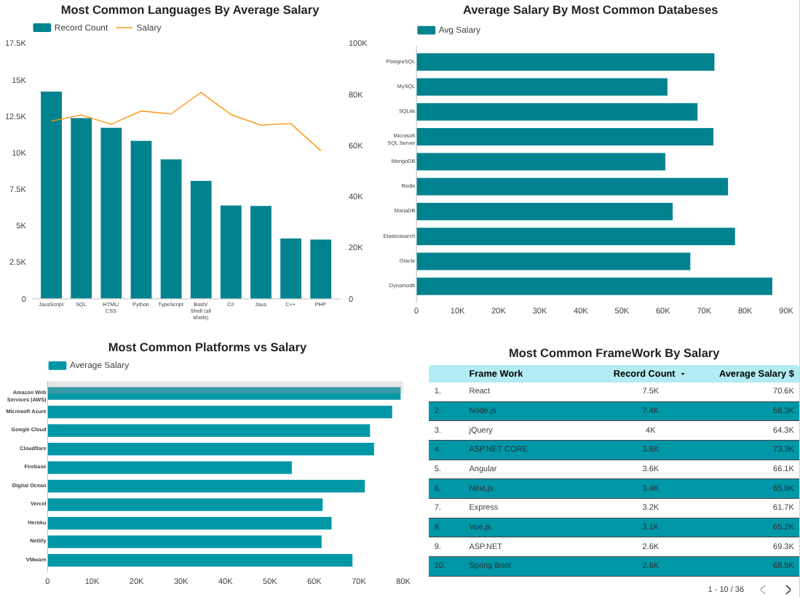
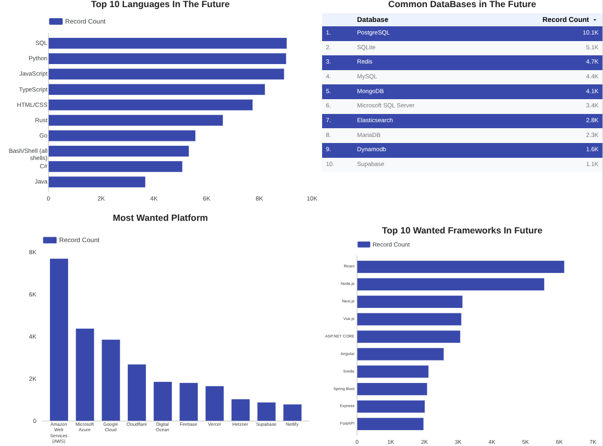
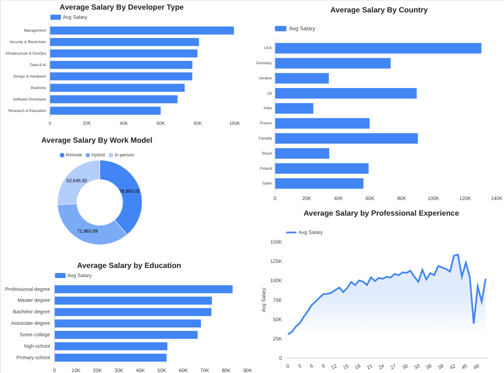
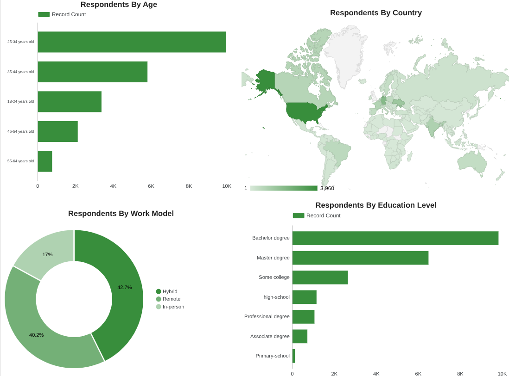

### 📊 End-to-End Analysis of Stack Overflow Developer Survey

***Project Overview***

This project analyzes the Stack Overflow Developer Survey to uncover key insights about developers' current and future technology preferences and demographic characteristics. The analysis covers technology categories such as languages, platforms, frameworks, and databases, as well as demographic factors including age, country, education level, role, and work model. It also examines how these factors influence annual compensation.

The project follows a complete data workflow including data loading, cleaning, analysis, and feature engineering using Python, and the development of interactive dashboards in Looker Studio to visualize and communicate the findings effectively.

🎯 ***Objectives***

- Identify popular technologies
- Explore future technology trends
- Analyze developer demographics
- Explore salary distribution and influencing factors
- Build an interactive dashboard for insights

🗂️ ***Dataset***

Source: Stack Overflow Developer Survey
Format: CSV
Records: 65,000
🔗 Data Workflow

### ***Data Loading***

Imported CSV into Python using Pandas

1. ***Data Cleaning***

Removed duplicate records to ensure data integrity.
Handled missing values by filling, filtering, or excluding key columns such as Compensation and Country.
Converted data types where necessary.
Cleaned and standardized categorical values to improve consistency across the dataset.
Processed multi-value categorical columns by splitting.
Removed or filtered extreme and unrealistic salary values to reduce the impact of outliers.

2. ***Data Analysis***

Performed exploratory data analysis to understand the distribution of developer demographics such as country, age, and education.
Analyzed annual compensation across different categories to identify salary trends.
Examined the most commonly used and desired languages, platforms, databases, and frameworks.
Grouped data and calculated summary statistics such as average salary and technology usage frequency.

3.***Feature Engineering***

Split multi-value categorical columns (e.g., programming languages, databases, platforms, and web frameworks) into individual values to enable clear visualization.
Created separate structured tables for each technology category such as languages and platforms.
Built a demographic table containing key attributes such as age and country.
Exported the transformed datasets as CSV files to prepare them for visualization and dashboard development in Looker Studio.

4. ***Data Visualization***
   
Built an interactive dashboard in Looker Studio showing:

- Annual compensation analysis by current and desired technologies such as languages, platforms, web frameworks, and databases.
- Comparison of average annual compensation across demographic and professional factors, including country, age group, developer role, education level, and work model.
- Visualization of respondent distribution across countries, age groups, and education levels to understand the demographic composition of the survey participants.

### 📊 Dashboard Preview

### 🌐 Live Dashboard

[View Interactive Dashboard](https://lookerstudio.google.com/reporting/04ee0546-a07c-42cd-b1cd-0aff7dc72c23)

### 🔎 Key Insights

- JavaScript, SQL, and HTML/CSS are the most widely used languages, while specialized technologies such as Bash/Shell and DynamoDB are associated with higher average salaries.
- PostgreSQL and Amazon Web Services (AWS) are the most commonly used and desired database and platform, highlighting their dominance in the modern development ecosystem.
- React and Node.js are the leading web frameworks and are also associated with higher developer compensation.
- Salary is strongly influenced by role, experience, and location, with management and security roles, experienced developers, and developers in the United States earning the highest salaries.
- Hybrid work is the most common model, while fully remote developers tend to earn higher average compensation.
- Most developers are aged 25–34 and hold a Bachelor's degree, representing the core demographic of the developer workforce.

### 🛠️ Tools Used

- Python (Pandas, NumPy, Matplotlib, Seaborn)
- Looker Studio
- Git & GitHub

### 👤 Author

Abdelhak Morhlia

